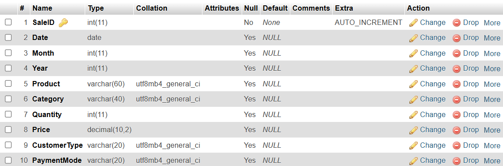
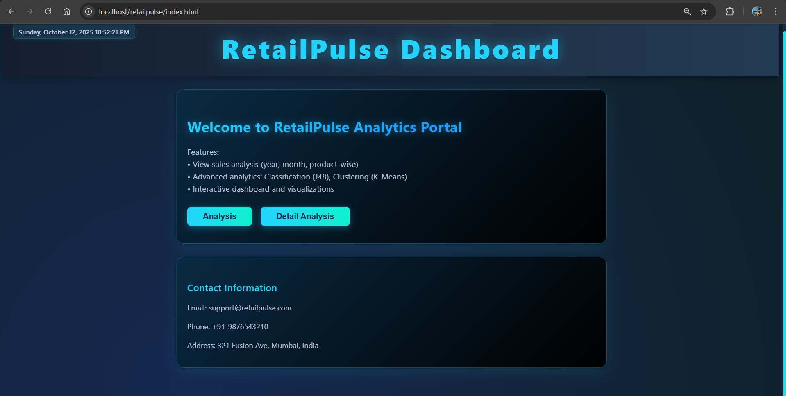
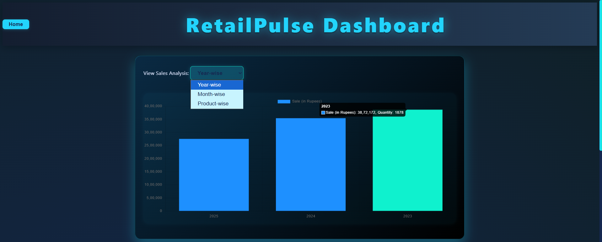
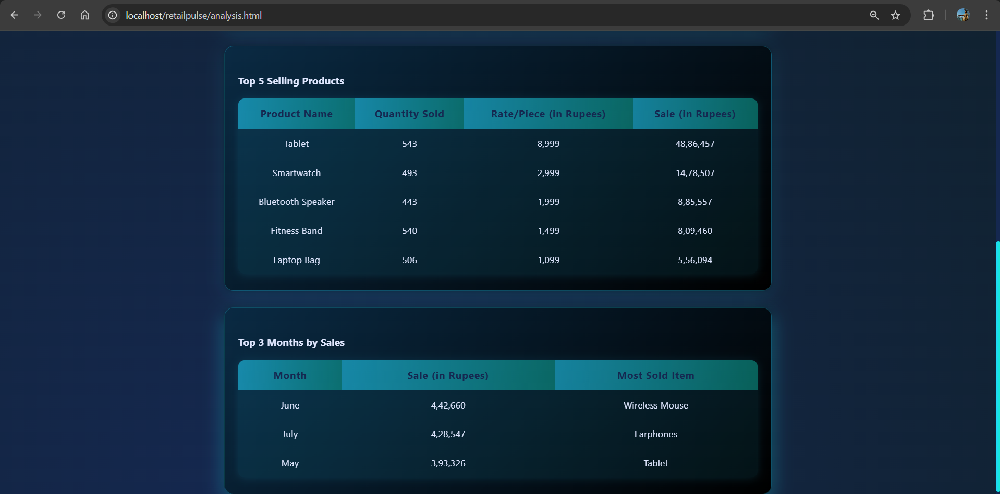
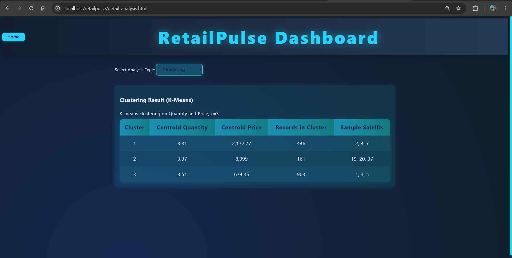
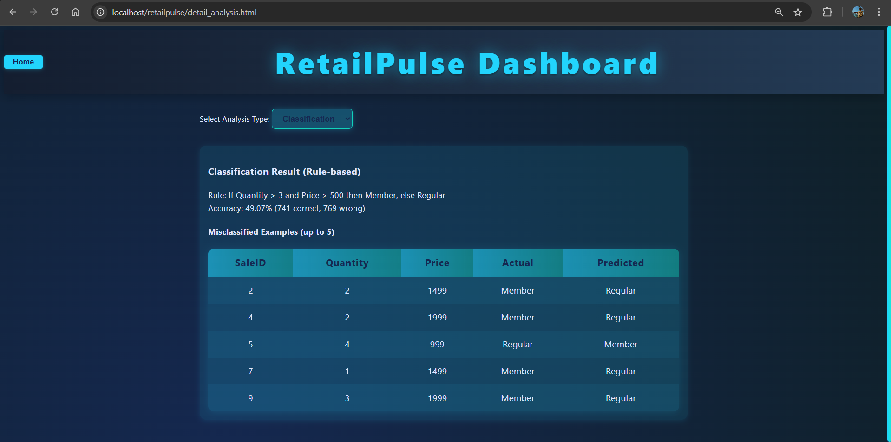

  # 📈 Retail Pulse

  *A data-driven analytics dashboard utilizing Machine Learning classification and clustering to uncover retail insights.*

  
  
  
  
  

---

## ✨ Features
- 🧠 **Smart Classification:** Rule-based algorithm to predict customer types based on purchasing habits.
- 🎯 **Customer Clustering:** Group retail behaviors dynamically for targeted insights.
- 📊 **Real-time Analytics:** Interactive frontend dashboard displaying sales trends.
- 🚀 **Fast API:** Lightweight PHP endpoints serving JSON data directly to the frontend.

## 📸 Screenshots

Here is a look at the system in action (extracted from the project report):

| Dashboard View | Data Analytics |
| :---: | :---: |
|  |  |

| Classification | Clustering |
| :---: | :---: |
|  |  |

<b>Click here to view more screenshots</b>

| Additional View 1 | Additional View 2 |
| :---: | :---: |
|  |  |

## 🛠️ Architecture
- **Frontend**: Raw HTML, CSS, and Vanilla JavaScript for zero-dependency performance.
- **Backend**: Procedural PHP APIs (`api/` folder) handling data extraction and algorithmic processing.
- **Database**: MySQL tracking Sales ID, Quantity, Price, and Customer Types.

## ⚙️ Local Setup Instructions
1. Clone this repository: `git clone https://github.com/ritesh-0608/retailpulse.git`
2. Move the `retailpulse` folder into your local server's root directory (e.g., `C:\xampp\htdocs\`).
3. Start **Apache** and **MySQL** via your XAMPP Control Panel.
4. Ensure `api/dbconnect.php` has your correct database credentials.
5. Open your browser and navigate to `http://localhost/retailpulse`.

---

  <i>Engineered with ❤️ by Ritesh.</i>

<!-- minor format update -->
